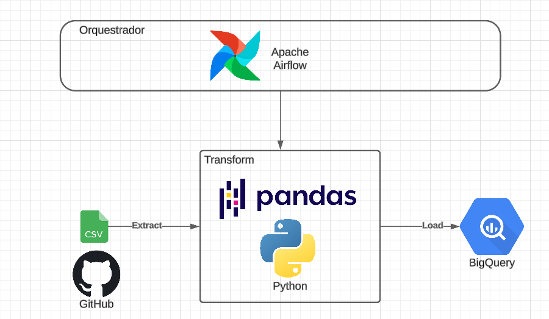
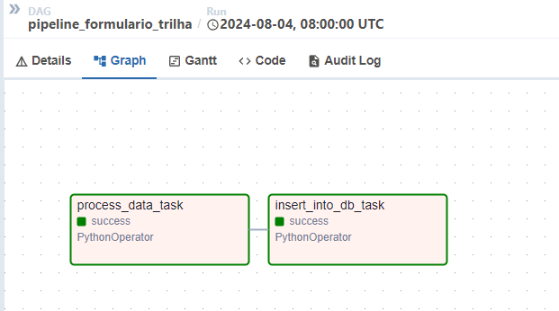
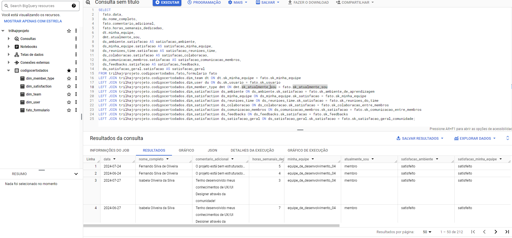
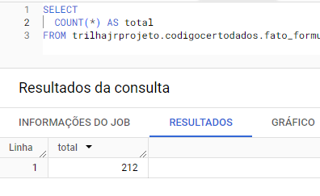
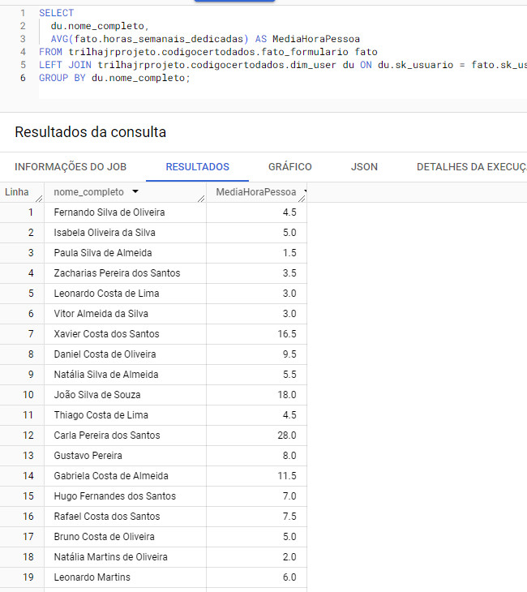

# Documentação do projeto

Tecnologias utilizadas para o desafio:
- Python
- Pandas
- BigQuery
- Airflow

O processo de ETL (Extract, Transform, Load) consistiu em:
Utilizei Python e Pandas para extrair os arquivos de CSV que estão na pasta data. Dessa forma, se futuramente novos dados forem adicionados ou removidos, eles serão considerados no processo. Pensando na modelagem dimensional, utilizei o esquema estrela, pois havia poucas dimensões, o que otimiza a consulta e a análise. O carregamento dos dados foi realizado no Google BigQuery.

### Diagrama utilizado na pipeline do desafio


### DAG no airflow


# Queries que foram utilizadas no BigQuery:
### Para criação das tabelas

Tabela fato:
```
CREATE TABLE `trilhajrprojeto.codigocertodados.fato_formulario`(
  sk_minha_equipe SMALLINT,
  sk_atualmente_sou SMALLINT,
  sk_reunioes_do_time SMALLINT,
  sk_colaboracao_entre_membros SMALLINT,
  sk_ambiente_de_aprendizagem SMALLINT,
  sk_comunicacao_entre_membros SMALLINT,
  sk_satisfacao_geral_comunidade SMALLINT,
  sk_feedbacks SMALLINT,
  sk_usuario SMALLINT,
  data DATE,
  horas_semanais_dedicadas INTEGER,
  comentario_adicional STRING
);
```

Tabelas dimensões:
```
CREATE TABLE `trilhajrprojeto.codigocertodados.dim_satisfaction` (
  sk_satisfacao SMALLINT,
  satisfacao STRING
);
```
```
CREATE TABLE `trilhajrprojeto.codigocertodados.dim_team` (
  sk_minha_equipe SMALLINT,
  minha_equipe STRING
);
```
```
CREATE TABLE `trilhajrprojeto.codigocertodados.dim_member_type` (
  sk_atualmente_sou SMALLINT,
  atualmente_sou STRING
);
```
```
CREATE TABLE `trilhajrprojeto.codigocertodados.dim_user` (
  sk_usuario SMALLINT,
  nome_completo STRING
);
```

### Query com a fato e dimensões no Bigquery:


#### Algumas queries no Bigquery
- Contagem de linhas



- Media de horas dedicadas por pessoas



# Respondendo as perguntas
P: Nossa infraestrutura de dados está impactando a performance da análise de feedbacks. Como você redesenharia a arquitetura para melhorar a eficiência?
-> Primeiramente, analisaria a infraestrutura existente, verificando se os tipos de dados estão corretos. Implementaria índices e particionamento para melhorar a performance das consultas. Além disso, revisaria os pipelines para identificar possíveis fontes de latência, especialmente se os dados estiverem sendo utilizados diretamente na ferramenta de visualização em vez de serem processados no banco de dados.

P: Nosso processo de ETL está gerando dados duplicados e inconsistentes. Como você resolveria esses problemas para garantir a integridade dos dados?
-> Utilizando técnicas de deduplicação, que identificam e eliminam registros duplicados. Dependendo da necessidade da empresa, é possível utilizar diferentes técnicas, como "comparação de campos específicos", verificação de campos selecionados ou "similaridade de strings", para verificar se diferentes entradas representam o mesmo dado, como, por exemplo, usuários digitando o mesmo estado de forma diferente. No Pandas, podemos usar o método .drop_duplicates(), como fiz no desafio. Em SQL, podemos usar o comando DISTINCT e criar uma view ou sobrescrever a tabela. Muitas nuvens também dão suporte a deduplicação dos dados.

P: Nossa ferramenta de visualização de dashboards está lenta e o nosso time detectou que o problema está na infraestrutura de dados. Como você abordaria esta situação do ponto de vista de arquitetura de dados?
-> Analisaria a estrutura do banco de dados para identificar possíveis gargalos, como falta de índices adequados ou consultas não otimizadas. Consideraria a implementação de views materializadas para pré-computar resultados complexos e reduzir o tempo de resposta. Também revisaria a arquitetura de armazenamento e distribuição dos dados, talvez adotando um sistema de sharding ou clustering para melhor distribuição da carga de trabalho.

P: Descreva como você projetaria um pipeline de ETL para integrar os feedbacks coletados em diferentes formatos (planilhas, formulários online, etc.) em um único data warehouse.
-> Projetaria um pipeline de ETL utilizando o Apache Airflow como orquestrador, o uso dele permite agendar, monitorar e gerenciar o fluxo de trabalho, tendo uma visão melhor se todas as etapas estão ocorrendo da maneira certa. O processo começaria com a ingestão de dados de várias fontes, como planilhas e formulários online, utilizando conectores (como Python ou outra ferramenta que a empresa possa utilizar) para realizar as extrações. Em seguida, aplicaria um conjunto de transformações para limpar e normalizar os dados. Por fim, os dados seriam carregados em um data warehouse centralizado, como o BigQuery ou outra que a empresa utilize, garantindo a integridade e a unificação dos dados.

P: Nossa área operacional necessita de informações em tempo real, porém os gestores da comunidade acompanham somente informações de KPIs mensais, alegam que isso é desnecessário e acarretaria custos. Qual é o seu posicionamento sobre isso?
-> Acredito que o acesso a informações em tempo real pode ser crucial para a operação, permitindo uma resposta rápida a eventos e situações. No entanto, é importante balancear os custos e benefícios. Podemos adotar uma abordagem híbrida, onde dados críticos são processados em tempo real, enquanto dados menos urgentes são processados em lote, para otimizar recursos e custos.

P: Como você implementaria práticas de governança de dados para assegurar que os feedbacks sejam armazenados e utilizados de maneira segura e conforme as políticas da comunidade?
-> Implementaria um conjunto de políticas de governança de dados que incluiriam controles de acesso rigorosos, criptografia de dados sensíveis, auditoria de atividades e mascaramento dos dados. Além disso, garantiria que todas as práticas de armazenamento e uso de dados estivessem em conformidade como a LGPD e que houvesse um processo claro para a gestão de consentimento e exclusão de dados.

P: Nosso time que está focado em Governança de Dados alega que documentar os processos é mais importante do que refatorar os mais de 500 scripts que estão funcionando com lentidão. Como você atuaria neste impasse, se tivesse que priorizar o trabalho?
-> Analisaria o impacto das duas abordagens e priorizaria as ações que gerassem maior valor para o negócio. Se a documentação é fundamental para a continuidade e compreensão dos processos, priorizaria essa atividade, mas também consideraria ações pontuais de refatoração para melhorar a performance dos scripts mais críticos, estabelecendo um plano de ação para abordar ambos os aspectos gradualmente.